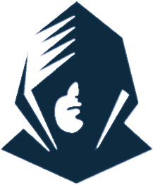

#  SysAdmin enfocado en la Cibeseguridad

## Hi there 👋

<!--
**Tony-Sec/Tony-Sec** is a ✨ _special_ ✨ repository because its `README.md` (this file) appears on your GitHub profile.

Here are some ideas to get you started:

- 🔭 I’m currently working on ...
- 🌱 I’m currently learning ...
- 👯 I’m looking to collaborate on ...
- 🤔 I’m looking for help with ...
- 💬 Ask me about ...
- 📫 How to reach me: ...
- 😄 Pronouns: ...
- ⚡ Fun fact: ...
--> 
## Contacto

hackerone
hackthebox
linkedin
## ⚡ Tecnologías más usadas

### 🚀 Lenguajes de programación 

### 🧩 Librerías & Frameworks 

### 📘 Otras...

## 📈 Trabajando en...
